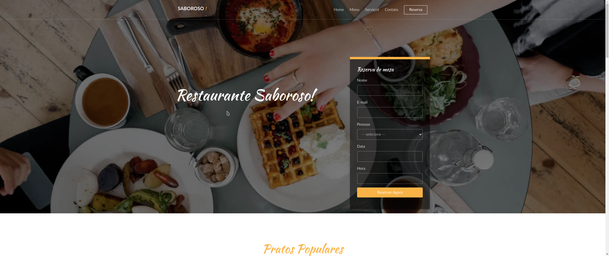

# Restaurante saboroso
Projeto desenvolvido durante o treinamento na Udemy com a equipe Hcode treinamentos.

## Reprodução em ambiente de desenvolvimento.
1- Efetue um clone da aplicação

2- Abra sua pasta no visual studio ou outro editor de código e execute npm install para instalar as dependências.

3- Em seguida npm start para subir o serviço, e você já poderá efetuar alterações no projeto e visualizar ao atualizar a página no navegador.

5- Fim

## Funcionalidades

1-Reservas no restaurante.

2-Entrar em contato com o restaurante.

3-Página administrativa com opções de manipulação dos dados salvos em banco.

## Tecnologias usadas

|  *Tecnologias*  |   *Versão*    |
| -------------   |:-------------:|
| Nodejs          |   *12.18.1*   |
| Bower           |   *1.8.8*     |
| Bootstrap       |   *^3.3.7*    |
| Express         |   *4.16.1*    |
| Template EJS    |   *2.6.1*     |
| Mysql2-connect  |   *2.1.0*     |
| Redis           |   *^3.0.2*    |
| express-session |   *^1.17.1*   |
| Moment-js       |   *^1.1.15*   |
